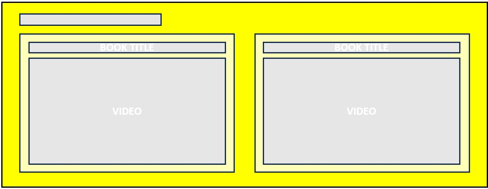
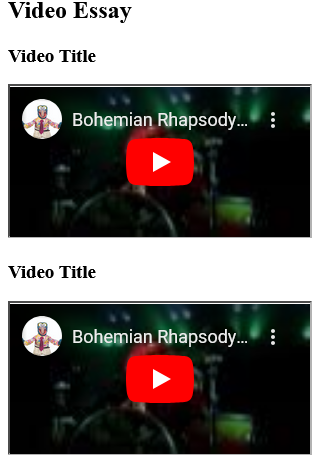

# CHECKPOINT 1 - TEAM 2 - ERLAND MAHESWARA

Sebuah website dimana orang-orang memberikan pendapat, rekomendasi mereka, dan tempat berdiskusi dari buku yang mereka telah baca. Layout dari halaman utama website adalah sebagai berikut.
 
 

 
 

## HEADER

Pada bagian terdapat 2 item, yaitu: nama website dan navigation bar.
 
 

 

 
 

## SECTION 1 / MOST PRAISED

Bagian ini menampilkan buku dengan rating dan review tertinggi.
 
 

 

 
 

## SECTION 2 / VIDEO ESSAY

Bagian ini menampilkan review buku dalam bentuk video
 
 

 

 
 

## SECTION 3 / GENRE

Bagian ini menampilkan semua genre yang ada dengan fitur pencarian. User dapat memilih beberapa genre untuk mencari buku sesuai dengan genre yang dipilih.
 
 

 
 

## SECTION 4 / SUBMIT YOURS

Pada bagian ini user dapat mengunggah review mereka terhadap buku ini pada form yang telah disediakan. Dalam form ini terdapat Gambar cover dari buku yang akan direview, cover ini muncul secara otomatis ketika user memasukkan sebuah judul buku pada form yang telah disediakan. Terdapat form "Genre" untuk memasukkan genre apa yang cocok untuk buku yang akan di review.
 
 

 

